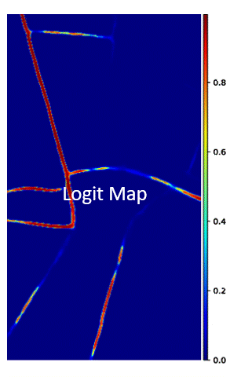
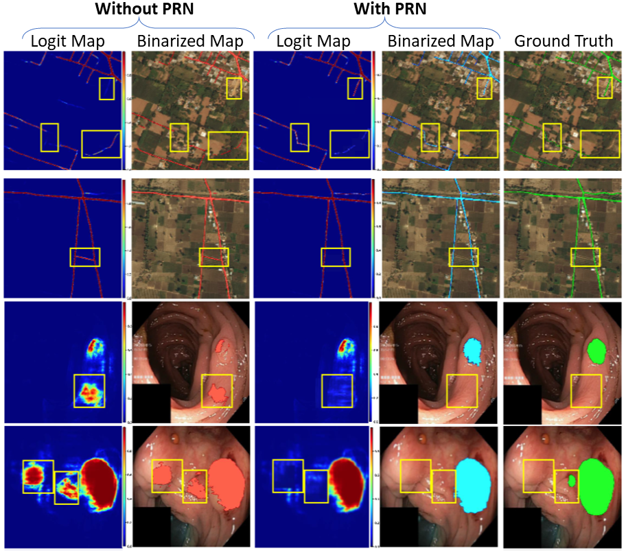

# PatchRefineNet: Improving Binary Segmentation by Incorporating Signals from Optimal Patch-wise Binarization
**Authors**: [Savinay Nagendra](https://github.com/savinay95n), [Daniel Kifer](https://github.com/dkifer), [Chaopeng Shen](https://github.com/chaopengshen)

**Links**: [[arXiv]](https://arxiv.org/abs/2211.06560) [[PDF]](https://arxiv.org/pdf/2211.06560.pdf)



# Introduction


The purpose of binary segmentation models is to determine which pixels belong to an object of interest (e.g.,which pixels in an image are part of roads).The models assign a logit score (i.e.,probability) to each pixel and these are converted in to predictions by thresholding (i.e.,each pixel with logit score ≥ τ is predicted to be part of a road). However, a common phenomenon in current and former state-of-theart segmentation models is spatial bias – in some patches, the logit scores are consistently biased upwards and in others they are consistently biased downwards. These biases cause false positives and false negatives in the final predictions. In this paper, we propose PatchRefineNet(PRN), a small network that sits on top of a base segmentation model and learns to correct its patch-specific biases. Across a wide variety of basemodels, PRN consistently helps them improve mIoU by 2-3%. One of the key ideas behind PRN is the addition of a novel supervision signal during training. Given the logit scores produced by the base segmentation model, each pixel is given a pseudo-label that is obtained by optimally thresholding the logit scores in each image patch. Incorporating these pseudo-labels into the loss function of PRN helps correct systematic biases and reduce false positives / negatives. Although we mainly focus on binary segmentation, we also show how PRN can be extended to saliency detection and few-shotsegmentation. We also discuss how the ideas can be extended to multiclass segmentation.

Here are some refinement results on high-resolution images:


## Getting Started
Note: The code has been tested on Ubuntu 18.04.6 LTS Bionic 

Folder structure:

```bash
 .
 ├── images
 ├── data_utils                   
 ├── src                    
 ├── download.py                     
 ├── requirements.txt                    
 ├── LICENSE
 └── README.md
```
    
Inside "src" folder, you will find source files for three datasets:
(a) deepglobe (b) DUTS (c) kvasir
